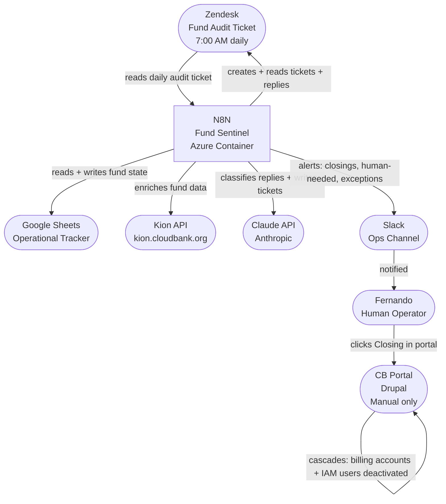
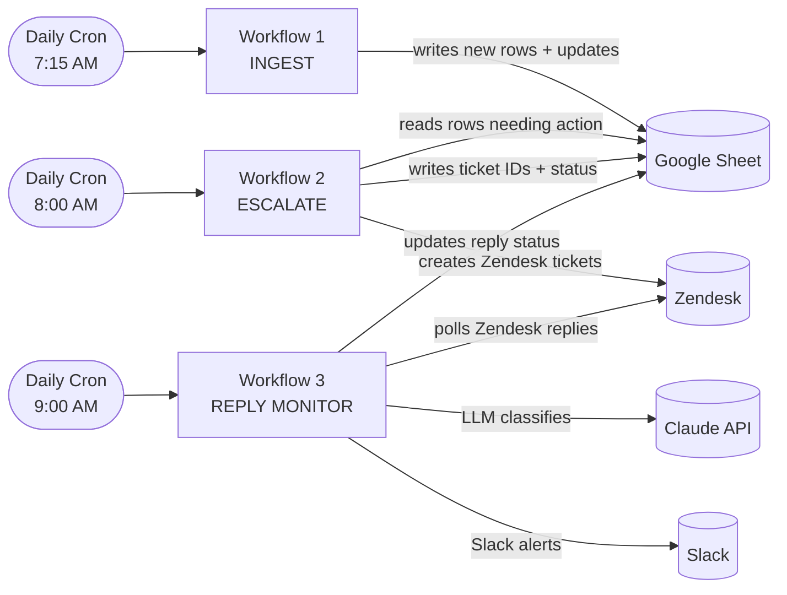
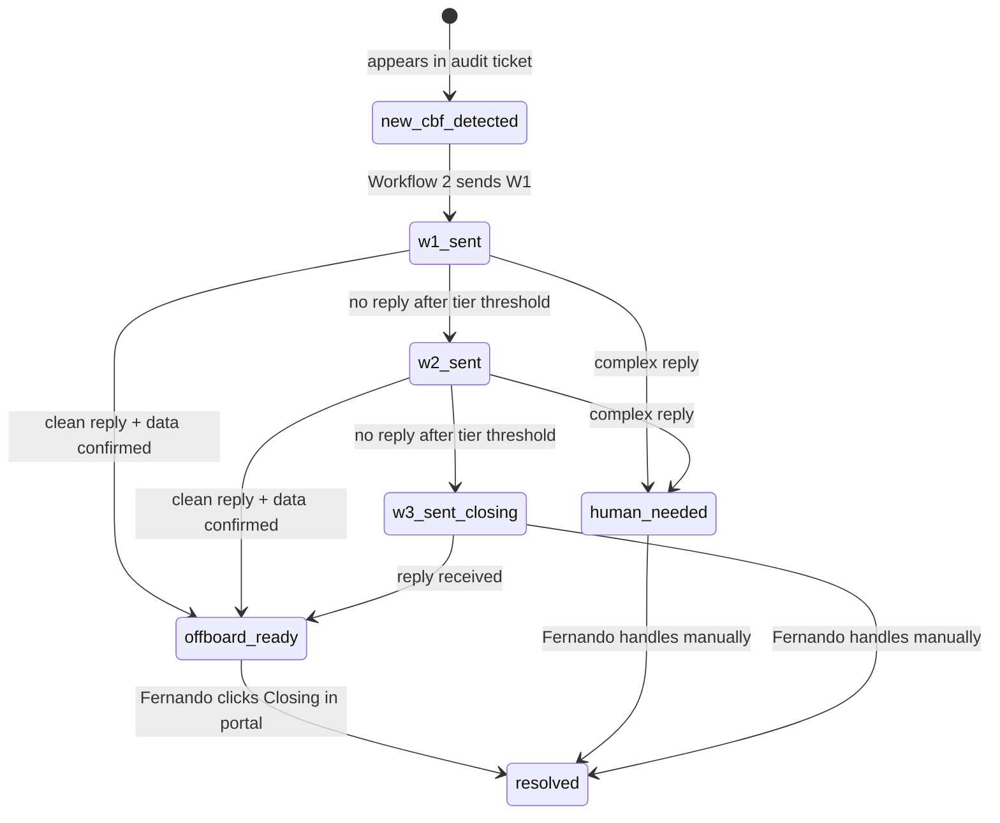
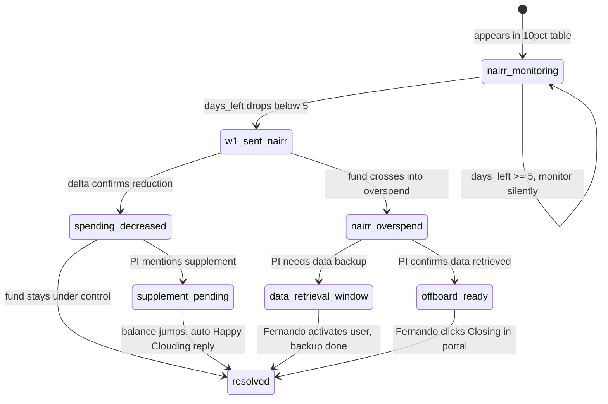

# CloudBank Fund Sentinel — System Architecture

> N8N automation system replacing Fernando's manual overspend follow-up workflow.

---

## System Context



**Key constraint:** The CB Portal has no REST API. Soft-offboard (fund → Closing) is always a manual human action. N8N flags it and notifies Fernando via Slack; Fernando does the portal click.

---

## N8N Workflows

### Overview



---

### Workflow 1: INGEST

**Trigger:** Daily cron at 7:15 AM (15 min after audit ticket is generated)

**Responsibility:** Parse the Fund Audit ticket → sync to Google Sheet

```
1. Search Zendesk for today's Fund Audit ticket (by tag or view)
2. Extract HTML table → parse 3 sections (CBF OS, NAIRR OS, NAIRR ≤10%)
3. For each fund:
   a. Look up fund_id in Google Sheet (column A)
   b. IF NEW CBF:
      - Note in sheet: no Kion enrichment needed for CBF (balances from ticket)
      - Check Zendesk for existing ticket history → write note to sheet cell
      - Set status = new_cbf_detected
   c. IF NEW NAIRR:
      - Enrich from Kion: GET /v3/funding-source/{id} (name, dates, ou_id)
      - Set status = new_nairr_detected
   d. IF EXISTING:
      - Update balance cells (cash + credit)
      - Recompute daily_rate + days_left (NAIRR only)
      - Check if tier changed (CBF only)
      - Check if balance jumped significantly (supplement approval check)
4. Write sentinel_version + last_enriched timestamp
```

**Outputs to Sheet:** balance cells, daily_rate, days_left, tier, status, ticket_history_note

---

### Workflow 2: ESCALATE

**Trigger:** Daily cron at 8:00 AM (after INGEST completes)

**Responsibility:** Read sheet rows that need action → generate + send Zendesk tickets

```
1. Read all sheet rows where status requires escalation
2. For each row:
   a. Determine what action is needed (W1 / W2 / W3 / 24h / overspend)
   b. LLM: generate ticket body from template + fund data
   c. IF dry_run == true:
      → Log intended action to DryRunLog tab
      → Skip all Zendesk writes
   d. IF dry_run == false:
      → Create Zendesk ticket (or add comment to existing)
      → Update sheet: followup_ticket_id, warning_N_date, status
3. For closing triggers:
   → Update sheet: status = closing_flagged
   → Send Slack alert to Fernando
```

**LLM inputs per ticket:** fund_id, PI name, funder, balance amounts, balance %, daily_rate, days_left (NAIRR), warning number, tier, cloud providers

---

### Workflow 3: REPLY MONITOR

**Trigger:** Daily cron at 9:00 AM

**Responsibility:** Poll Zendesk for replies → classify → update sheet → alert

```
1. Read sheet rows with open followup_ticket_id
2. For each: GET Zendesk ticket comments
3. IF new comment since last_reply_date:
   a. LLM: classify reply
      → ready_to_offboard | supplement_in_progress | no_response | human_needed
   b. Update sheet: reply_classification, last_reply_date, next_action
   c. IF ready_to_offboard: ask data retrieval question (new Zendesk comment)
   d. IF human_needed: Slack Fernando with ticket link + one-line summary
   e. IF supplement_in_progress: monitor balance for jump (handled by Workflow 1)
4. For NAIRR: check balance jump separately (see Workflow 1 supplement detection)
```

---

## Data Flow: CBF Fund Lifecycle



---

## Data Flow: NAIRR Fund Lifecycle



---

## Environment Variables

| Variable | Description | Default |
|---|---|---|
| `dry_run` | When true, log all writes to DryRunLog tab instead of executing | `true` |
| `test_sheet_id` | Google Sheet ID used during development | test copy |
| `prod_sheet_id` | Google Sheet ID for production | real tracker |
| `zendesk_test_group_id` | Zendesk group ID with no external email notifications | test group |
| `slack_channel_ops` | Slack channel for Fernando alerts | ops channel |

---

## Credentials (stored in N8N vault — never in sheet or workflow config)

| Credential | Type |
|---|---|
| Zendesk API token | Basic auth: username + token |
| Kion API token | Bearer token |
| Google service account | JSON keyfile |
| Anthropic API key | Bearer token |
| Slack webhook | Webhook URL |

---

## Deployment

- **Host:** Azure Container Instance or Azure App Service
- **Image:** `n8nio/n8n`
- **Execution history:** 30 days minimum (audit trail)
- **Access:** CloudBank Operations team only

---

## Limitations & Out of Scope (MVP)

| Item | Reason |
|---|---|
| CB Portal REST API | Does not exist — soft-offboard is manual |
| Cloud console actions (stop/delete VMs) | Requires cloud console access — Fernando does manually |
| BigQuery daily spend | Available but not needed — audit ticket + Kion financials sufficient |
| Azure billing spreadsheet parsing | Brittle web scraping — replaced by asking PI what services they use |
| AMIE state management | Out of scope for this project |
| Beam (Nutanix) integration | Daily_rate derived from balance delta — no Beam API needed |
