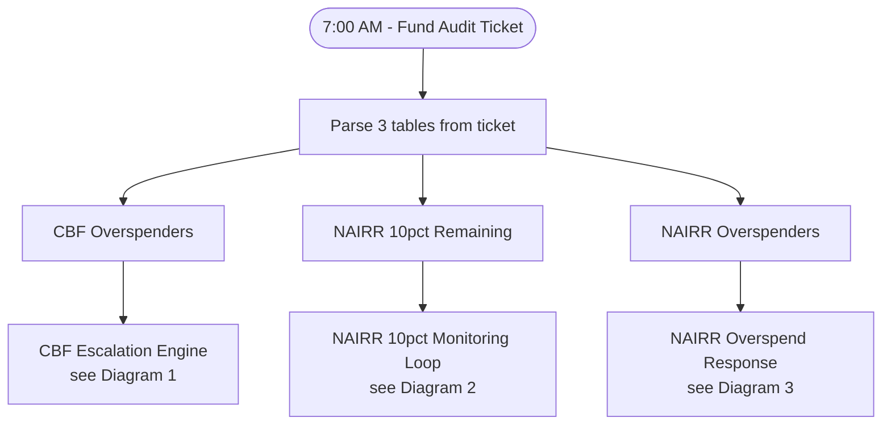
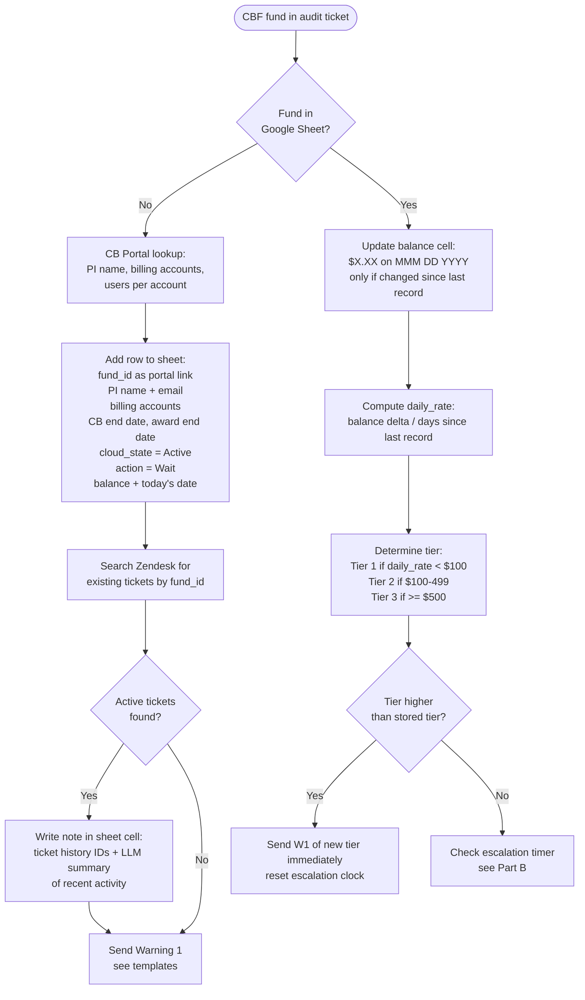
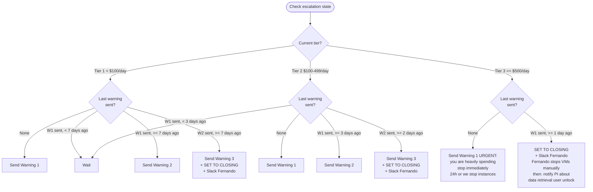
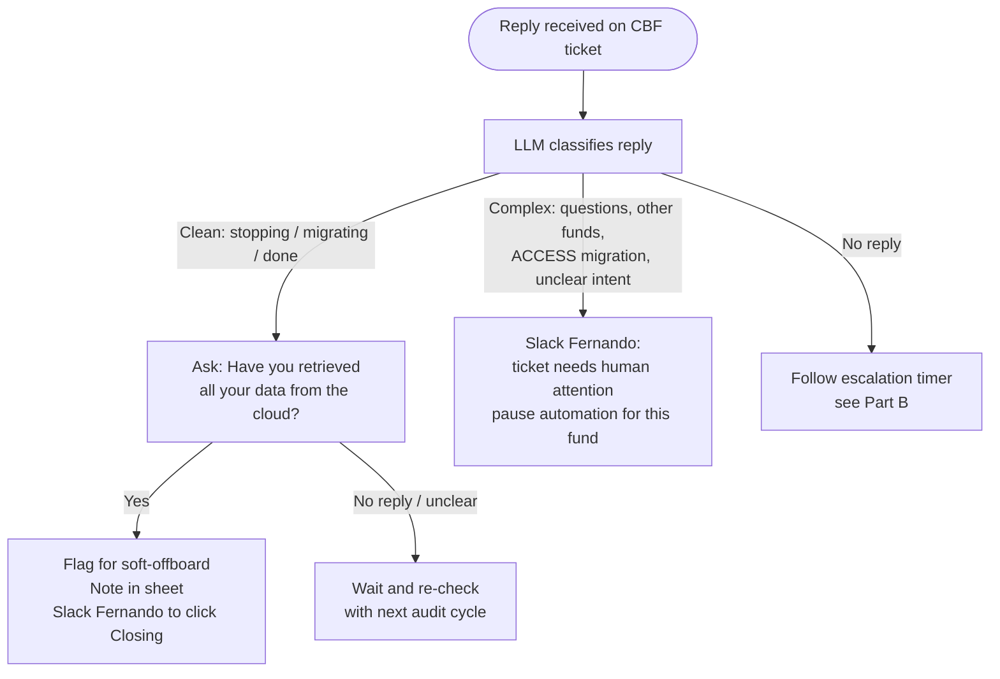
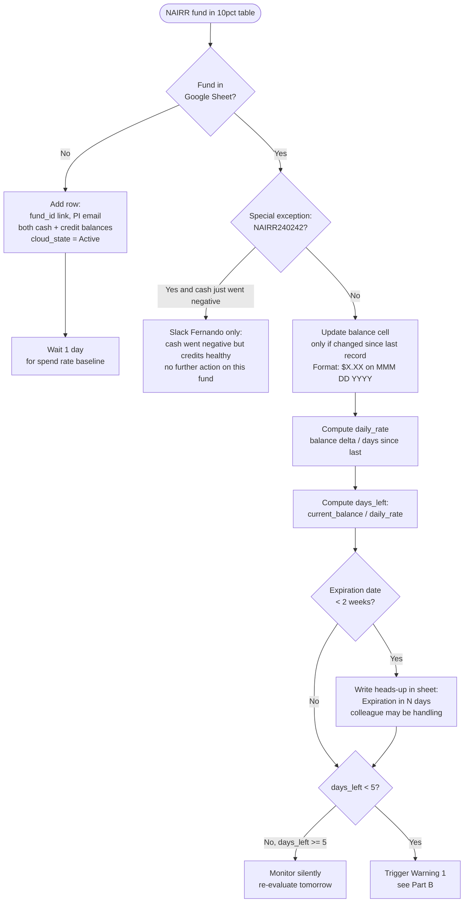
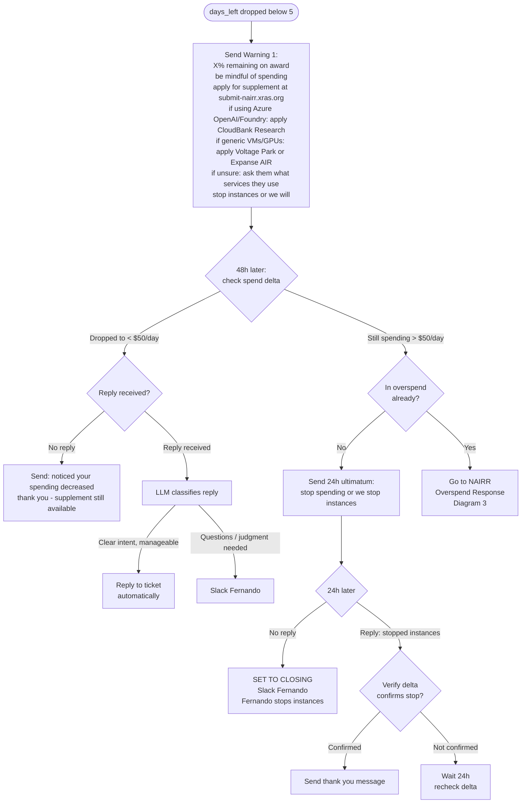
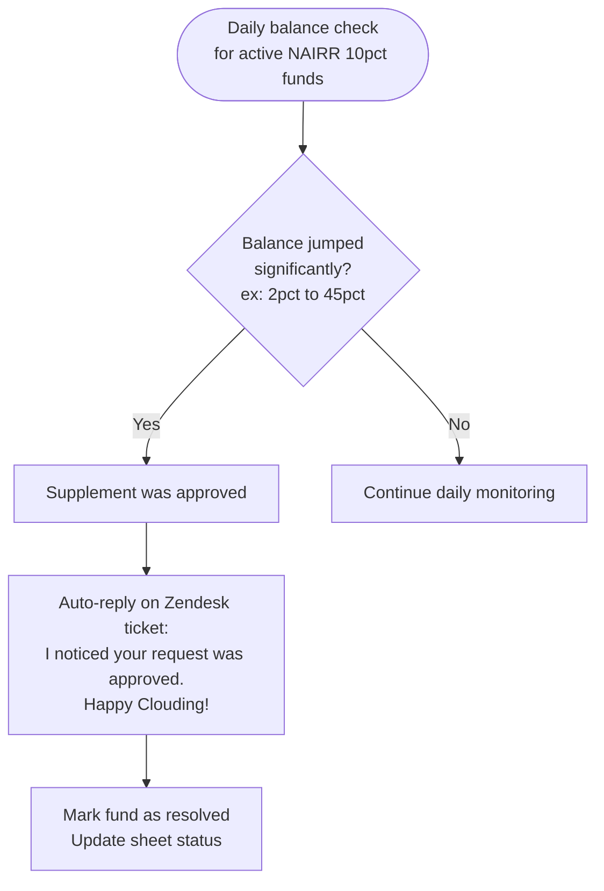
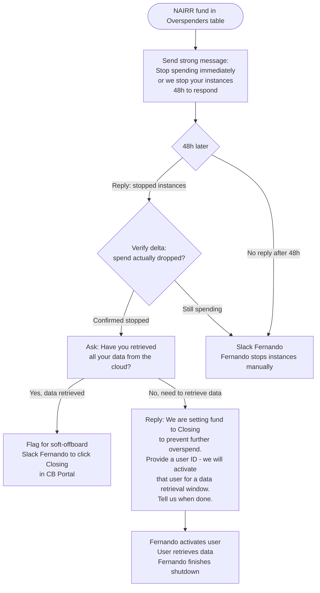

# CloudBank Fund Sentinel — Manual Process Flow

> Captures Fernando's current manual workflow — the process Fund Sentinel automates.
> Diagrams use [Mermaid](https://mermaid.js.org/) and render in VS Code (install: *Markdown Preview Mermaid Support*) and GitHub.

---

## Daily Trigger

Every morning at **7:00 AM** a Fund Audit Zendesk ticket is auto-generated with three tables:

| Table | What it contains |
|---|---|
| Non-NAIRR Overspenders (CBF) | CBF funds with cash or credit balance < $0 |
| NAIRR Overspenders | NAIRR funds with cash or credit balance < $0 |
| NAIRR ≤10% Remaining | NAIRR funds with cash or credit ≤ 10% of award (not yet overspending) |

---

## Diagram 1 — CBF Escalation Engine

> Non-NAIRR CloudBank Funds. Reported only when overspending (cash or credit balance negative).

### Part A: New vs Existing Fund

### Part B: Escalation Tiers & Timers

### Part C: Reply Handling (CBF)

---

## Diagram 2 — NAIRR ≤10% Monitoring Loop

> NAIRR funds are credit-heavy, spend $1000s/day. Goal: avoid overspend entirely.
> Supplement option is offered once (in Warning 1). Never offered again.

### Part A: New vs Existing Fund

### Part B: Warning & Escalation

### Part C: Supplement & Balance Recovery

---

## Diagram 3 — NAIRR Overspend Response

> Rare — most NAIRR funds are caught at ≤10% before crossing into overspend.
> Supplement is NOT offered again here — it was already in Warning 1 of the ≤10% flow.

---

## Special Cases

### NAIRR240242
- Has ~$0 cash remaining but healthy credits
- If cash goes negative: **Slack Fernando only** — do not trigger offboard or warnings
- This is a fund-specific exception, not a general rule

### Zendesk ticket history check (CBF)
Before sending Warning 1 on a newly detected CBF fund:
- Search Zendesk for any tickets referencing this fund_id
- If active/open tickets found: still send W1, but write a note in the sheet cell with ticket IDs and an LLM-generated one-line summary of recent activity
- Lets Fernando see context at a glance without digging into Zendesk

### Balance recording rule
- N8N only writes a new balance entry if the balance **changed** since the last recorded value
- Format in sheet cell: `$1,323.93 on Feb 4 2026`
- No change = no write (avoids noise in the sheet)

---

## Reply Classification Guide (for LLM node)

| Reply signals | Classification | N8N action |
|---|---|---|
| "stopped instances", "shutting down", "migrating to ACCESS", "all done" | `ready_to_offboard` | Ask about data retrieval |
| "supplement request in progress", "applied for supplement" | `supplement_in_progress` | Monitor balance for jump |
| Auto-reply, out-of-office, blank | `no_response` | Follow escalation timer |
| Questions about another fund, ACCESS details, billing, extensions, unclear intent | `human_needed` | Slack Fernando, pause automation |
| Dispute, frustration, anger, threats | `human_needed` | Slack Fernando, pause automation |

---

## CBF Migration Offer Rule (updated 2026-03-19, per Shava)

**CBF only — does not apply to NAIRR.**

Always offer the ACCESS migration option before off-boarding. Never skip it.
The migration recommendation is tailored by monthly spend (`daily_rate × 30`):

| monthly_spend | Recommendation in ticket |
|---|---|
| < $3,083/month (< $37K/year) | Encourage migration to ACCESS — good fit, can stay on CloudBank |
| ≥ $3,083/month (≥ $37K/year) | Include migration offer, but also write a note in the sheet: "High spender (~$Xk/month, ~$Xk/year) — may be a better fit for NAIRR, review with Shava" |

The $37K/year threshold (~$3,083/month) reflects what CloudBank can sustainably support. Above that, NAIRR is a better fit. The decision is still human-reviewed — N8N flags it, Fernando and Shava decide.

**monthly_spend source: Kion** — use `POST /v3/spend-report/funding-source` with the **last full calendar month** (not current month — partial data). Sum `spend` across all accounts for the fund. Fallback: `daily_rate × 30` if Kion unavailable.

If `monthly_spend ≥ $3,083`: Slack Fernando — "Fund X spending ~$Y/month (~$Z/year), exceeds $37K/year threshold, likely NAIRR candidate. W1 sent."

### ACCESS migration text (CBF W1 — approved by Shava)

> If you'd like to continue running on CloudBank, please migrate your account to ACCESS. You should have received an email on March 5 with instructions asking you to complete the migration by May 1. We recommend starting the migration as soon as possible since you are now overspent. Just as a reminder, instructions can be found here: https://www.cloudbank.org/training/access-cloudbank-research.

This replaces the previous text that said CloudBank "will transition in the next few months" — CloudBank is already in production.

---

## Warning Email Templates Reference

See `docs/templates.md` *(to be created in Sprint 3)* for full LLM prompt templates for each warning type.

| Template ID | Used for |
|---|---|
| `cbf_w1` | CBF Warning 1 (any tier) — always includes ACCESS migration offer |
| `cbf_w1_tier3` | CBF Warning 1, Tier 3 urgent — includes migration offer + heavy spend language |
| `cbf_w2` | CBF Warning 2 — re-emphasizes migration offer before escalating |
| `cbf_w3` | CBF Warning 3 + closing notice |
| `nairr_w1_10pct` | NAIRR ≤10% Warning 1 (includes supplement options) |
| `nairr_24h` | NAIRR 24h ultimatum |
| `nairr_overspend_strong` | NAIRR Overspend initial strong message |
| `nairr_thank_you` | NAIRR spending decrease acknowledgement |
| `supplement_approved` | Balance jumped — supplement approved |
